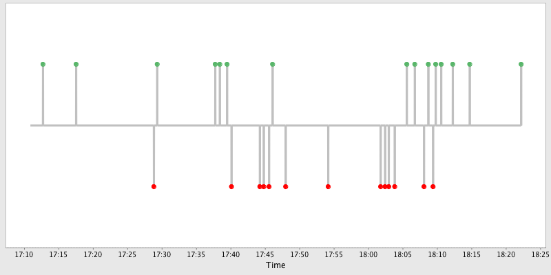

## TDD Coding Dojo UAL 

This repository contains the source code used in the first Test Driven Development (TDD) Coding Dojo realized at the University of Almería.

#### Date
Tuesday 13, May 2014. University of Almería

#### Kata
Convert roman numbers into arabic numbers.

#### Language
Java

### Pulse

This is the activity obtained with [Pulse](http://www.happyprog.com/pulse/) for the coding session.
[Pulse](http://www.happyprog.com/pulse/) is a plugin for Eclipse that allows to monitor the heartbeat of your TDD flow.

